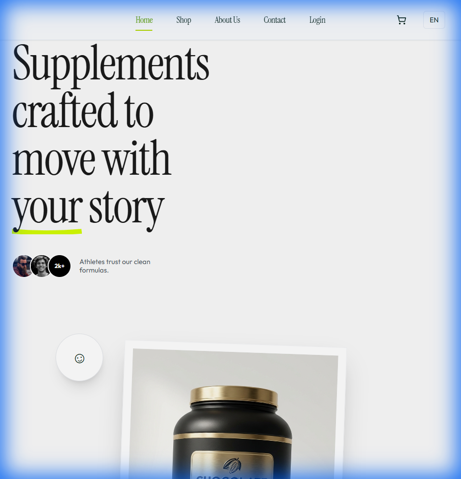
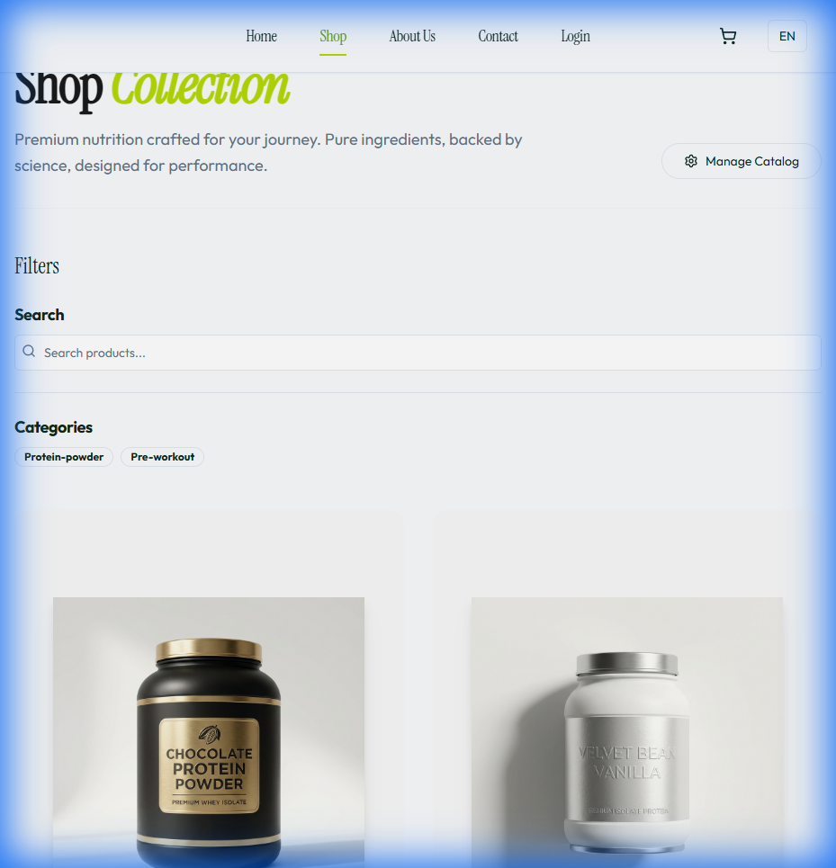
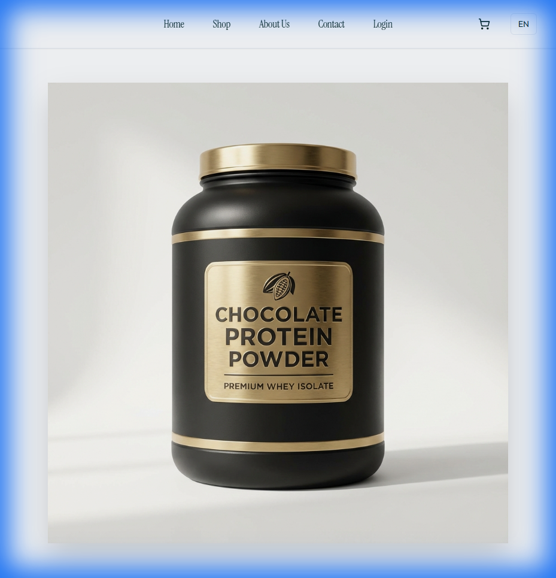
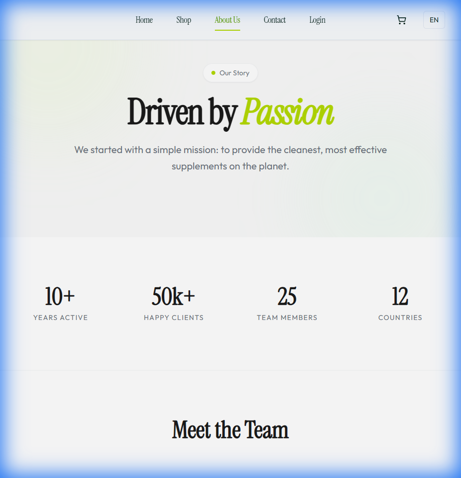
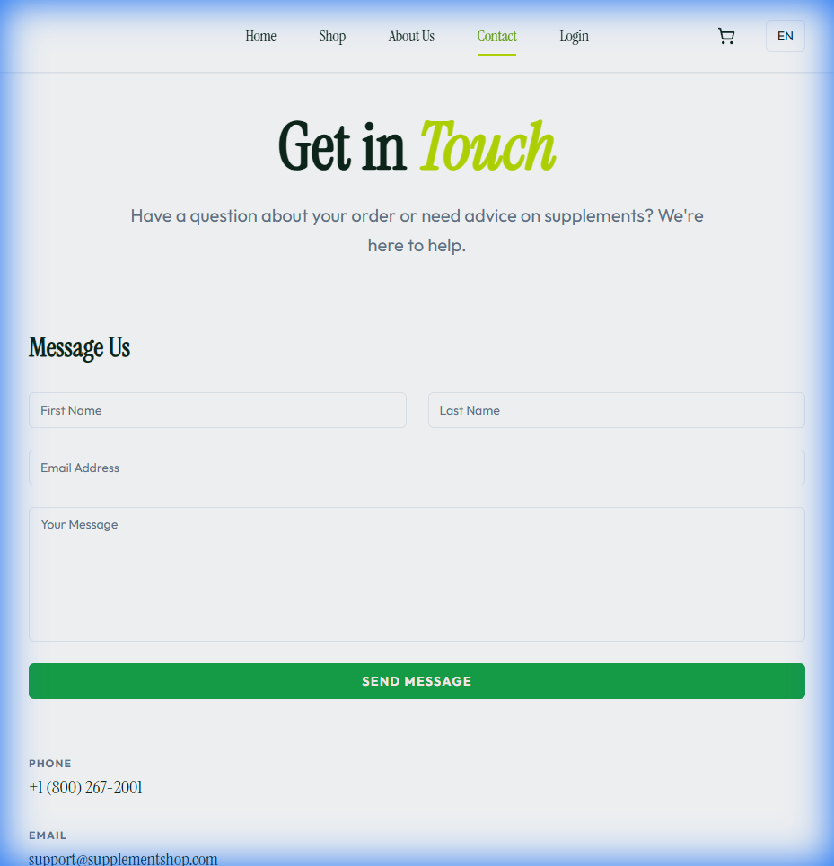

# Supplement Shop

A modern, premium e-commerce platform designed for the fitness lifestyle. This project features a high-end "Editorial" aesthetic, combining clean lines, sharp typography (`Instrument Serif` & `Outfit`), and a seamless user experience.



## Overview

The Supplement Shop is a full-stack web application built to deliver a luxury shopping experience for health and wellness products. It moves away from generic "card-based" interfaces to a flatter, magazine-style layout that emphasizes content and brand identity.

## Key Features

*   **Editorial Design System**: A custom design language featuring flat UI elements, sharp edges, and a sophisticated color palette (`Lime` & `Monochrome`).
*   **Dynamic Product Catalog**: Interactive product listings with filtering and detailed views.
*   **Rich Product Details**: Deep-dive product pages showing nutritional facts, ingredient breakdowns, and benefits in a clean, readable format.
*   **Shopping Cart**: Fully functional cart management with persistent state.
*   **Secure Authentication**: User registration and login system protected by JWT.
*   **Admin Dashboard**: Powerful tools for managing products, orders, and users.

## Editorial Experience

### Shop & Browse
The product collection grid is designed to be immersive, letting the high-quality 3D renders take center stage.


### Product Detail
Product information is presented clearly with a focus on typography and hierarchy, removing unnecessary borders and shadows for a cleaner look.


### Brand Story
The "About" page uses a magazine-spread layout to tell the brand story without the clutter of traditional containers.


### Contact & Support
A minimalist contact form and FAQ section that maintains the premium feel even for support pages.


## Tech Stack

### Frontend
*   **Framework**: [React 19](https://react.dev/)
*   **Styling**: [Tailwind CSS](https://tailwindcss.com/)
*   **Animations**: [Framer Motion](https://www.framer.com/motion/)
*   **Routing**: [TanStack Router](https://tanstack.com/router)
*   **State & Data**: [TanStack Query](https://tanstack.com/query)

### Backend
*   **Runtime**: [Node.js](https://nodejs.org/) & [Bun](https://bun.sh/)
*   **Framework**: [Express](https://expressjs.com/)
*   **Database**: [MongoDB](https://www.mongodb.com/)
*   **Language**: [TypeScript](https://www.typescriptlang.org/)

## Getting Started

### Prerequisites
*   [Bun](https://bun.sh/) (Recommended) or Node.js
*   MongoDB instance (Local or Atlas)

### Installation

1.  **Clone the repository**
    ```bash
    git clone https://github.com/carsonSgit/supp-shop.git
    cd supp-shop
    ```

2.  **Install Frontend Dependencies**
    ```bash
    cd apps/frontend
    bun install
    ```

3.  **Install Backend Dependencies**
    ```bash
    cd ../backend
    bun install
    ```

4.  **Environment Setup**
    Create a `.env` file in `apps/backend` with your MongoDB URI and secrets:
    ```env
    MONGO_URL=mongodb://localhost:27017/supplement-shop
    JWT_SECRET=your_secret_key
    ```

5.  **Run Development Servers**
    *   Backend: `cd apps/backend && bun dev`
    *   Frontend: `cd apps/frontend && bun start`

## License
MIT
